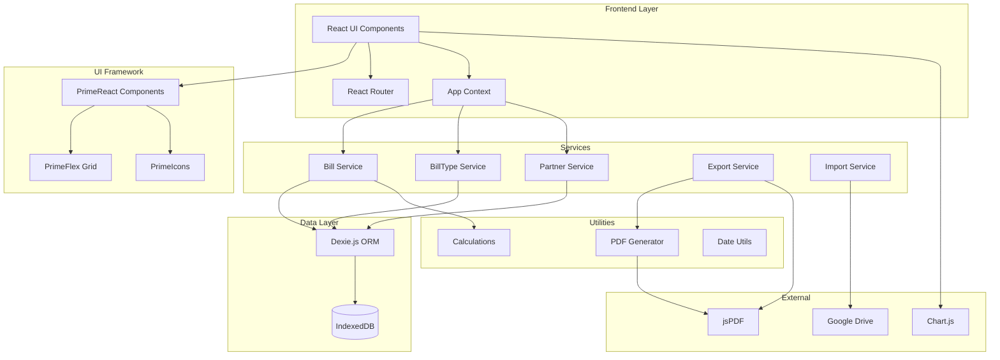
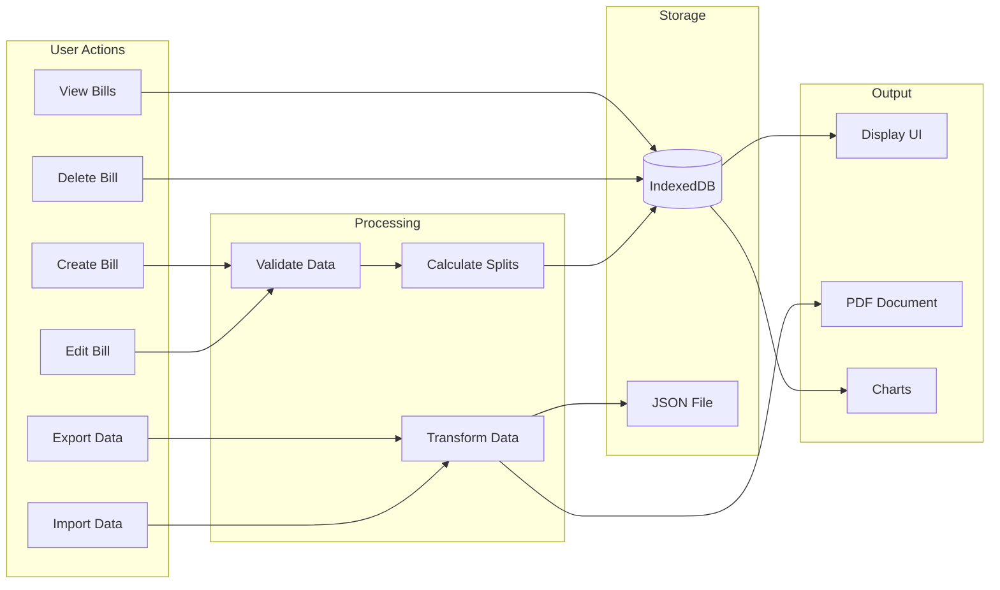
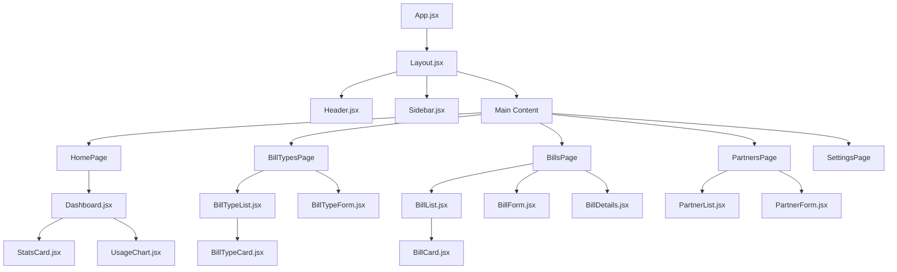
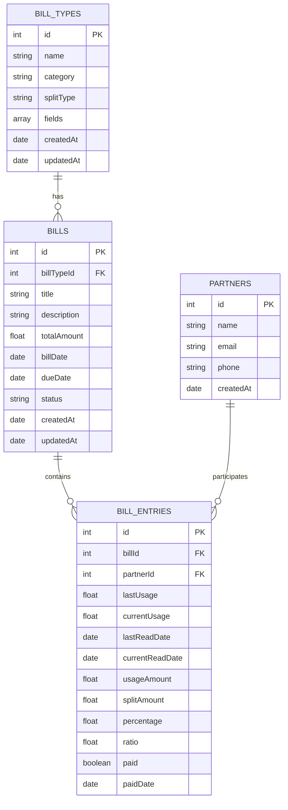
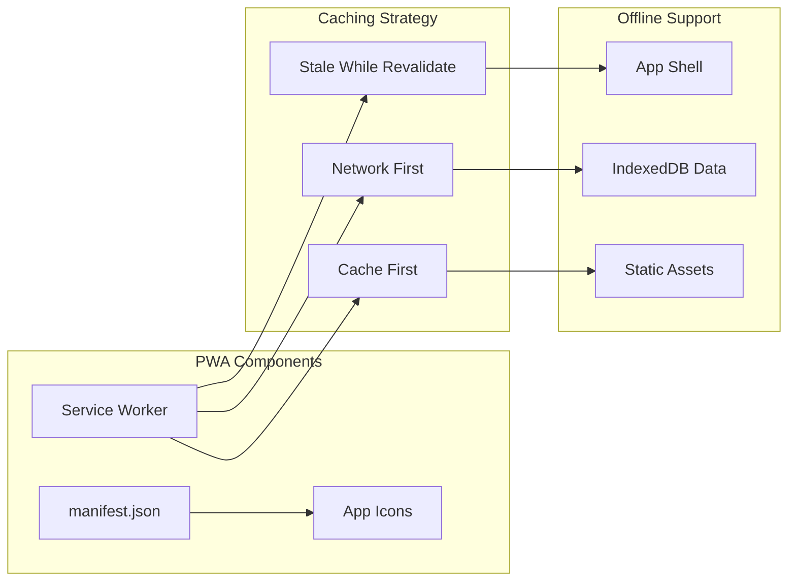

# Bill Dividing PWA - Architecture Diagram

## System Architecture

```mermaid
graph TB
    subgraph "Frontend Layer"
        UI[React UI Components]
        Router[React Router]
        Context[App Context]
    end

    subgraph "UI Framework"
        PrimeReact[PrimeReact Components]
        PrimeFlex[PrimeFlex Grid]
        PrimeIcons[PrimeIcons]
    end

    subgraph "Data Layer"
        Dexie[Dexie.js ORM]
        IDB[(IndexedDB)]
    end

    subgraph "Services"
        BillSvc[Bill Service]
        BillTypeSvc[BillType Service]
        PartnerSvc[Partner Service]
        ExportSvc[Export Service]
        ImportSvc[Import Service]
    end

    subgraph "Utilities"
        Calc[Calculations]
        PDF[PDF Generator]
        Date[Date Utils]
    end

    subgraph "External"
        ChartJS[Chart.js]
        jsPDF[jsPDF]
        GDrive[Google Drive]
    end

    UI --> PrimeReact
    UI --> Router
    UI --> Context
    PrimeReact --> PrimeFlex
    PrimeReact --> PrimeIcons

    Context --> BillSvc
    Context --> BillTypeSvc
    Context --> PartnerSvc

    BillSvc --> Dexie
    BillTypeSvc --> Dexie
    PartnerSvc --> Dexie
    Dexie --> IDB

    BillSvc --> Calc
    ExportSvc --> PDF
    ExportSvc --> jsPDF
    ImportSvc --> GDrive

    UI --> ChartJS
    PDF --> jsPDF
```

## Data Flow

```mermaid
flowchart LR
    subgraph "User Actions"
        Create[Create Bill]
        Read[View Bills]
        Update[Edit Bill]
        Delete[Delete Bill]
        Export[Export Data]
        Import[Import Data]
    end

    subgraph "Processing"
        Validate[Validate Data]
        Calculate[Calculate Splits]
        Transform[Transform Data]
    end

    subgraph "Storage"
        DB[(IndexedDB)]
        File[JSON File]
    end

    subgraph "Output"
        Display[Display UI]
        PDF[PDF Document]
        Chart[Charts]
    end

    Create --> Validate
    Read --> DB
    Update --> Validate
    Delete --> DB
    Export --> Transform
    Import --> Transform

    Validate --> Calculate
    Calculate --> DB
    Transform --> File
    Transform --> PDF

    DB --> Display
    DB --> Chart
```

## Component Hierarchy

```mermaid
graph TD
    App[App.jsx]
    App --> Layout[Layout.jsx]
    Layout --> Header[Header.jsx]
    Layout --> Sidebar[Sidebar.jsx]
    Layout --> Main[Main Content]

    Main --> Home[HomePage]
    Main --> BillTypes[BillTypesPage]
    Main --> Bills[BillsPage]
    Main --> Partners[PartnersPage]
    Main --> Settings[SettingsPage]

    Home --> Dashboard[Dashboard.jsx]
    Dashboard --> StatsCard[StatsCard.jsx]
    Dashboard --> UsageChart[UsageChart.jsx]

    BillTypes --> BillTypeList[BillTypeList.jsx]
    BillTypeList --> BillTypeCard[BillTypeCard.jsx]
    BillTypes --> BillTypeForm[BillTypeForm.jsx]

    Bills --> BillList[BillList.jsx]
    BillList --> BillCard[BillCard.jsx]
    Bills --> BillForm[BillForm.jsx]
    Bills --> BillDetails[BillDetails.jsx]

    Partners --> PartnerList[PartnerList.jsx]
    Partners --> PartnerForm[PartnerForm.jsx]
```

## Database Schema Diagram

```mermaid
erDiagram
    BILL_TYPES ||--o{ BILLS : has
    BILLS ||--o{ BILL_ENTRIES : contains
    PARTNERS ||--o{ BILL_ENTRIES : participates

    BILL_TYPES {
        int id PK
        string name
        string category
        string splitType
        array fields
        date createdAt
        date updatedAt
    }

    BILLS {
        int id PK
        int billTypeId FK
        string title
        string description
        float totalAmount
        date billDate
        date dueDate
        string status
        date createdAt
        date updatedAt
    }

    BILL_ENTRIES {
        int id PK
        int billId FK
        int partnerId FK
        float lastUsage
        float currentUsage
        date lastReadDate
        date currentReadDate
        float usageAmount
        float splitAmount
        float percentage
        float ratio
        boolean paid
        date paidDate
    }

    PARTNERS {
        int id PK
        string name
        string email
        string phone
        date createdAt
    }
```

## PWA Architecture

```mermaid
graph LR
    subgraph "PWA Components"
        Manifest[manifest.json]
        SW[Service Worker]
        Icons[App Icons]
    end

    subgraph "Caching Strategy"
        CacheFirst[Cache First]
        NetworkFirst[Network First]
        StaleWhile[Stale While Revalidate]
    end

    subgraph "Offline Support"
        AppShell[App Shell]
        Data[IndexedDB Data]
        Assets[Static Assets]
    end

    Manifest --> Icons
    SW --> CacheFirst
    SW --> NetworkFirst
    SW --> StaleWhile

    CacheFirst --> Assets
    NetworkFirst --> Data
    StaleWhile --> AppShell
```
